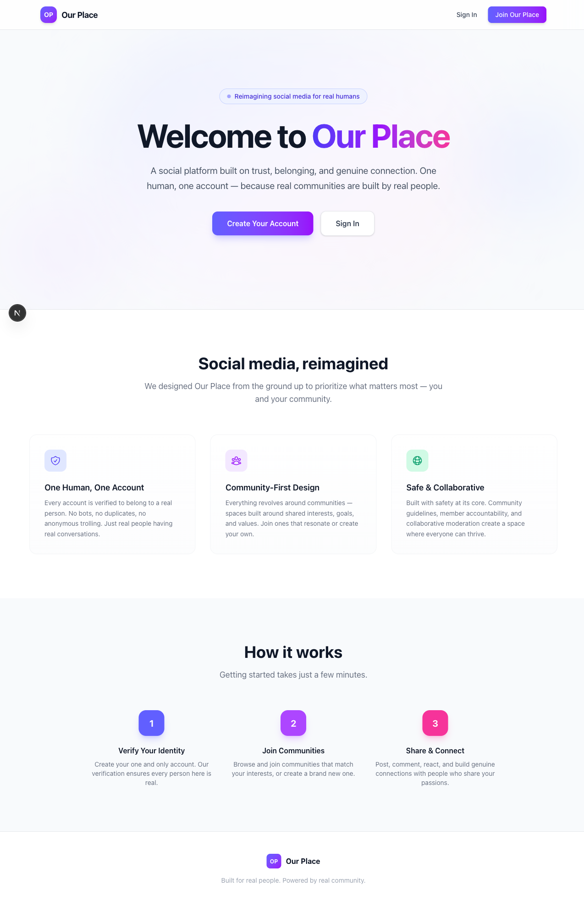

# Our Place

A community forum and social platform built on trust, belonging, and genuine connection. One human, one account — because real communities are built by real people.



## What is Our Place?

Our Place is a Reddit-inspired community platform with a twist: an **8-bit RPG overworld** where each community is a building in a town. Users walk around, explore, and enter buildings to access forum content — think Roblox meets Reddit, but pixel art.

The forum is fully functional today. The game world is actively in development.

## Features

### Forum Platform
- **Communities** — Create or join communities organized by category (Gaming, Creative, Tech, etc.)
- **Rich Posts** — Text, photo, video, and rich editor post types
- **Comments & Reactions** — Threaded comments and emoji reactions on posts
- **Events** — Community event creation and management
- **Feed** — Personalized feed with explore and friends tabs
- **My Place** — Personal profile space for each user
- **File Uploads** — Image and media uploads with validation

### Authentication & Security
- JWT auth with httpOnly cookies and bcrypt password hashing
- Email verification and password reset flows
- Rate limiting on content creation routes
- Content Security Policy headers
- Zod schema validation on API request bodies

### 8-Bit World (In Progress)
- Tile-based game engine built with React and HTML Canvas
- Player movement (WASD/arrows + mobile touch D-pad)
- Camera system, collision detection, and walk animations
- Building interaction system with fade transitions
- Responsive canvas scaling for mobile

## Tech Stack

| Layer | Technology |
|-------|-----------|
| Framework | Next.js 16 (App Router) |
| Language | TypeScript |
| Database | SQLite (better-sqlite3) |
| Styling | Tailwind CSS |
| Auth | JWT + bcrypt |
| Validation | Zod |
| Testing | Vitest (unit), Playwright (UI) |

## Project Structure

```
src/
├── app/
│   ├── api/            # REST API routes
│   │   ├── auth/       # Register, login, verify, password reset
│   │   ├── communities/# CRUD, join/leave, posts
│   │   ├── posts/      # Comments, reactions
│   │   ├── feed/       # Personalized, explore, friends
│   │   ├── my-place/   # Personal space posts
│   │   ├── events/     # Community events
│   │   └── upload/     # File uploads
│   ├── auth/           # Auth pages (login, register, verify, etc.)
│   ├── communities/    # Community browsing and detail pages
│   ├── feed/           # Feed dashboard
│   ├── world/          # 8-bit overworld page
│   └── profile/        # User profile
├── components/         # Reusable React components
│   ├── WorldCanvas.tsx # Game engine canvas component
│   ├── PostCard.tsx    # Post display
│   ├── Navbar.tsx      # Navigation bar
│   └── ...
└── lib/
    ├── game/           # Game engine (sprites, input, engine, types)
    ├── types/          # TypeScript type definitions
    ├── schemas.ts      # Zod validation schemas
    ├── pagination.ts   # Pagination utilities
    └── media-utils.ts  # File upload helpers
```

## Getting Started

### Prerequisites
- Node.js 18+
- npm

### Installation

```bash
git clone https://github.com/luke-whitaker/our-place.git
cd our-place
npm install
```

### Development

```bash
npm run dev
```

Open [http://localhost:3000](http://localhost:3000) — the SQLite database initializes automatically on first run.

### Other Commands

| Command | Purpose |
|---------|---------|
| `npm run build` | Production build |
| `npm run lint` | ESLint |
| `npm run format` | Prettier auto-fix |
| `npm run test` | Run unit tests |
| `npm run test:watch` | Run tests in watch mode |

## Roadmap

- [x] Core forum platform (communities, posts, comments, reactions)
- [x] Authentication with email verification
- [x] Rich post types and file uploads
- [x] Feed system with explore/friends tabs
- [x] My Place personal profiles
- [x] Security hardening (CSP, rate limits, Zod validation)
- [x] Game engine foundation (canvas, movement, camera, interactions)
- [ ] Static town map with community buildings
- [ ] Dynamic world generation from database
- [ ] Pixel art assets (sprites, terrain, buildings)
- [ ] Player identity tied to user accounts
- [ ] Real-time multiplayer presence

## Related

- [Portfolio Site](https://github.com/luke-whitaker/portfolio-site) — My pixel-art RPG portfolio, the prototype that inspired the game engine in this project

## Author

**Luke Whitaker** — Linguist, researcher, and developer working at the intersection of language, technology, and digital interfaces.
