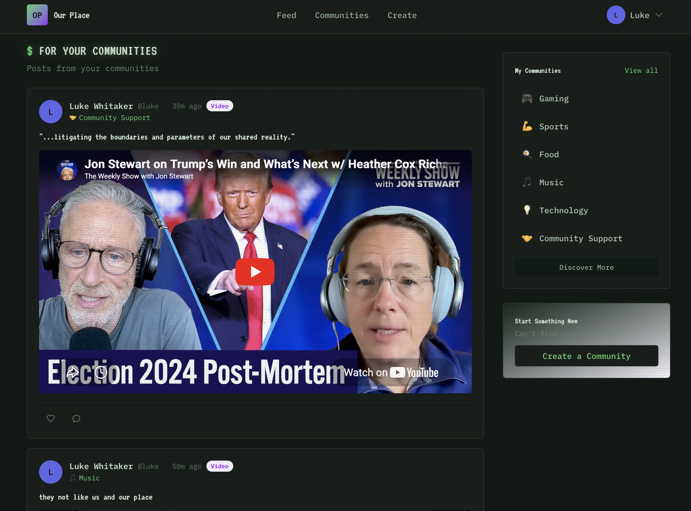
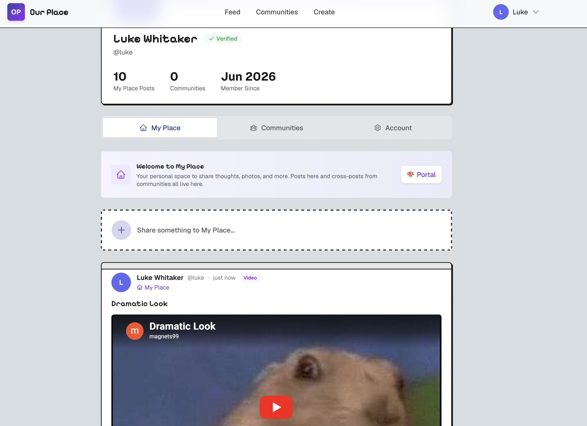
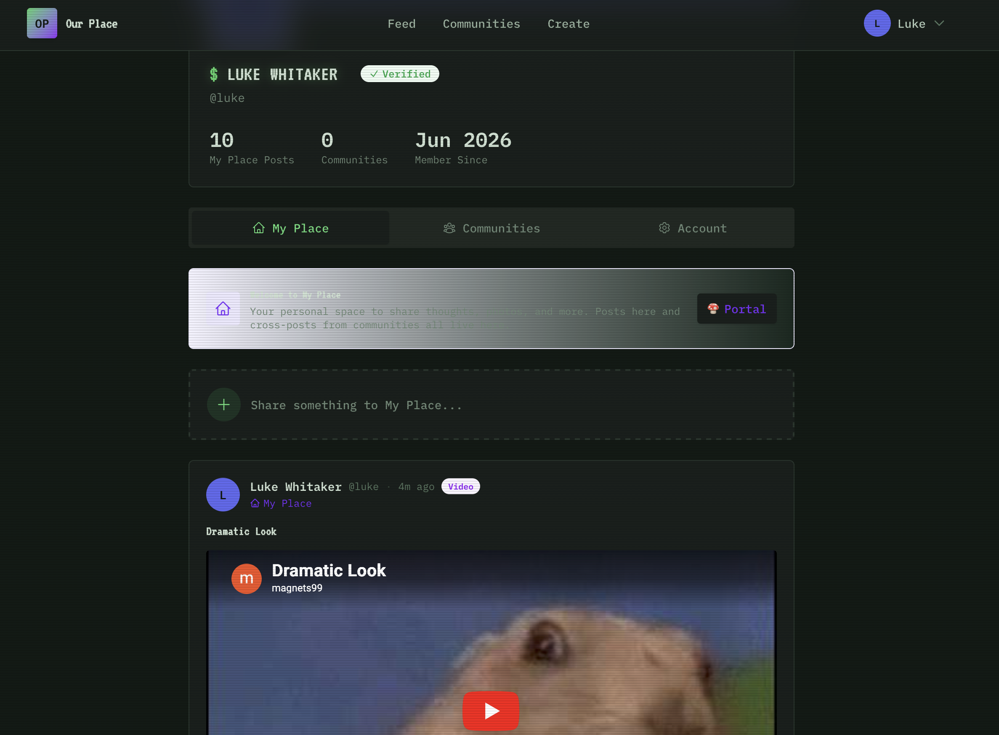
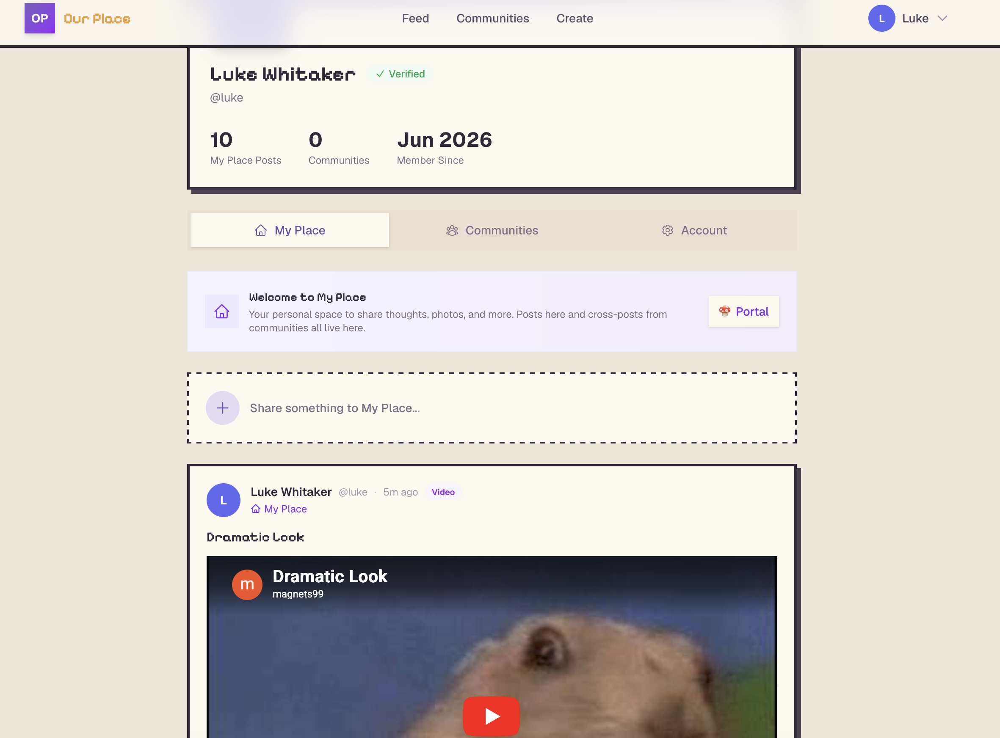
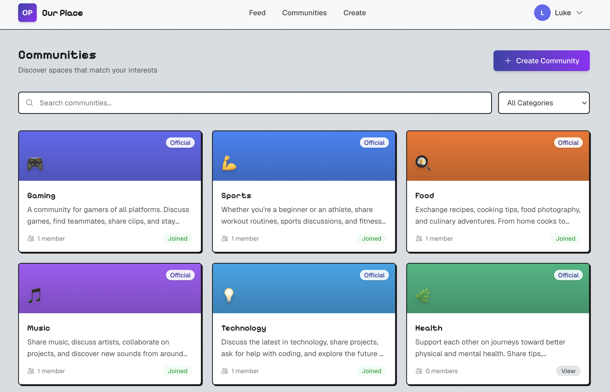
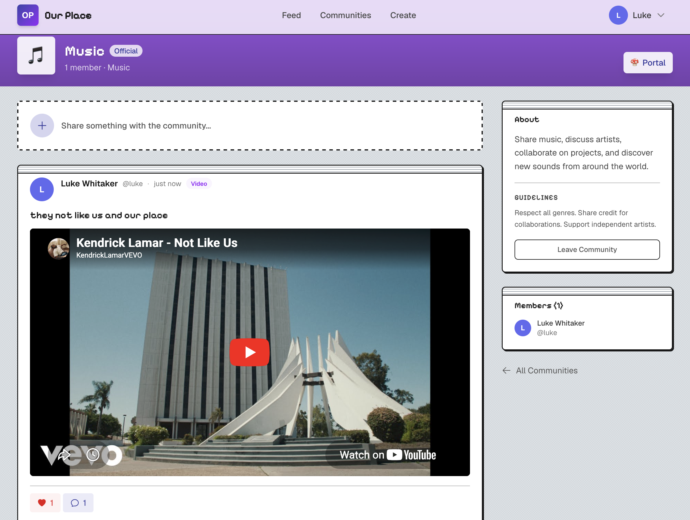

# Our Place

An invite-only community platform built on trust, belonging, and genuine human connection. Every account represents someone you've met face-to-face.



## What is Our Place?

Our Place is a community platform built on one conviction: **online spaces should be rooted in real-world relationships.** It brings the analog back into the digital — every account begins with a face-to-face connection, and everything the platform does is meant to push interaction back out into the real world.

There is no public registration. Accounts are created in person by existing members who have met you face-to-face. This "web of trust" means every person here is a real human, vouched for by someone in the community — and it's how Our Place grows beyond its first members.

Most social media silos people into echo chambers and infinite scroll. Our Place is the opposite: a digital layer for real communities, where you keep up with what's happening locally, start and share events, and turn online conversations into in-person ones.

### Two ways to experience it

- **The forum** — a Reddit-/Discord-inspired space to follow the communities you care about: post, comment, react, and organize events. Familiar social media, without the dark patterns.
- **The world** — an **8-bit RPG overworld** you can teleport into, where each community is a building in a town. Instead of scrolling mindlessly, you wander, explore, and build — leaving room for the kind of boredom that turns into a creative idea. Approach a building and step inside to reach its forum content. Think Roblox meets Reddit, but pixel art.

The forum is fully functional today. The world is actively in development.

## Philosophy

- **Social Media That's Actually Social** — The goal isn't time-on-app, it's getting people offline and together. Digital interaction here is a means to real-world connection, not a replacement for it.
- **In-Person First** — Accounts are created face-to-face by an admin or trusted member. No anonymous sign-ups, no bots, no strangers. Every user is someone a real person has met and vouched for.
- **Web of Trust** — The community grows organically through real relationships. You can trace every account back to a chain of people who know each other.
- **Your Algorithm, Your Rules** — Users will control their own feed algorithm. No engagement-maximizing dark patterns, no infinite dopamine loops. You decide what you see.
- **Physical Third Spaces** — The long-term vision includes physical community spaces (coffee shops, coworking hubs) where Our Place serves as the digital layer for a real neighborhood.

## Features

### Forum Platform

- **Communities** — Create or join communities organized by category (Gaming, Creative, Tech, etc.)
- **Rich Posts** — Text, photo, video, and rich editor post types
- **Comments & Reactions** — Threaded comments and emoji reactions on posts
- **Events** — Community event creation and management
- **Feed** — Personalized feed with explore and friends tabs
- **My Place** — Personal profile space for each user
- **File Uploads** — Image and media uploads with validation

### Authentication & Security

- **Invite-only accounts** — admin-only account creation via dashboard (`/admin`)
- JWT auth with httpOnly cookies and bcrypt password hashing
- Password reset flow
- Rate limiting on all auth and content creation routes
- Zod schema validation on all API request bodies
- Role-based access control (admin/user roles)
- **Account settings** — update your email, phone, and password (current password required)

### Three Themes

Three hand-built retro themes, switchable any time in **profile → Account → Appearance**:

- **Platinum** — System 7 / classic-Mac chrome: pinstriped window cards, 1-bit hard shadows, a dithered desktop, and a pixel wordmark.
- **Terminal** — dark phosphor: monospace body text, `$`-prompt headings with a blinking cursor, and faint CRT scanlines.
- **Pixel Dusk** — warm paper, chunky plum RPG-dialog borders, hard offset shadows, and buttons that press down when you click them.

The default, **Auto**, follows the clock — Platinum by day, Terminal at night — so the place looks different depending on when you visit. Your choice saves to your account and follows you across devices.

### 8-Bit World (In Progress)

- Tile-based game engine built with React and HTML Canvas (32px tiles)
- Player movement (WASD/arrows + mobile touch D-pad)
- Camera system, collision detection, and walk animations
- Building interaction system with fade transitions
- Responsive canvas scaling for mobile
- **Avatar builder** — gender-neutral character customization (hair, skin, shirt, pants) on first login
- **Procedural frontier generator** — deterministic 500×500 tile world with 6 themed biomes (flower meadow, beach, mountain valley, island, misty grove, ancient ruins), the capital city stamped at its center, passages, a river system, and a mushroom warp network between shrines

## Screenshots

### Three themes, one place

The same My Place profile rendered in each built-in theme. **Auto** mode switches between Platinum and Terminal with the time of day.

<table>
  <tr>
    <td align="center"><strong>Platinum</strong><br><sub>System 7 · day</sub></td>
    <td align="center"><strong>Terminal</strong><br><sub>phosphor · night</sub></td>
    <td align="center"><strong>Pixel Dusk</strong><br><sub>warm paper · opt-in</sub></td>
  </tr>
  <tr>
    <td></td>
    <td></td>
    <td></td>
  </tr>
</table>

### Around the platform

**Communities** — discover and join spaces organized by category.



**Inside a community** — posts, threaded comments, and emoji reactions.



## Tech Stack

| Layer      | Technology                     |
| ---------- | ------------------------------ |
| Framework  | Next.js 16 (App Router)        |
| Language   | TypeScript                     |
| ORM        | Prisma 7                       |
| Database   | PostgreSQL                     |
| Styling    | Tailwind CSS                   |
| Auth       | JWT + bcrypt                   |
| Validation | Zod                            |
| Testing    | Vitest (unit), Playwright (UI) |

## Project Structure

```
src/
├── app/
│   ├── api/            # REST API routes
│   │   ├── admin/      # Admin dashboard API (user management)
│   │   ├── auth/       # Login, password reset
│   │   ├── communities/# CRUD, join/leave, posts
│   │   ├── posts/      # Comments, reactions
│   │   ├── feed/       # Personalized, explore, friends
│   │   ├── my-place/   # Personal space posts
│   │   ├── events/     # Community events
│   │   └── upload/     # File uploads
│   ├── admin/          # Admin dashboard (account creation)
│   ├── auth/           # Auth pages (login, password reset)
│   ├── communities/    # Community browsing and detail pages
│   ├── feed/           # Feed dashboard
│   ├── world/          # 8-bit overworld page
│   └── profile/        # User profile
├── components/         # Reusable React components
│   ├── WorldCanvas.tsx # Game engine canvas component
│   ├── PostCard.tsx    # Post display
│   ├── Navbar.tsx      # Navigation bar
│   └── ...
├── generated/prisma/   # Auto-generated Prisma client (not committed)
└── lib/
    ├── game/           # Game engine (sprites, input, engine, types, tileset)
    ├── types/          # TypeScript type definitions
    ├── db.ts           # Prisma client singleton
    ├── schemas.ts      # Zod validation schemas
    ├── pagination.ts   # Pagination utilities
    └── media-utils.ts  # File upload helpers
prisma/
├── schema.prisma       # Database schema (source of truth)
├── migrations/         # Prisma migration history
└── seed.ts             # Seed data (9 starter communities)
scripts/
├── generate-world.ts   # Procedural frontier world generator (deterministic)
├── generate-tiles.lua  # Aseprite script — generate tile sprite sheet
└── generate-player.lua # Aseprite script — generate player sprite sheet
public/world/
├── world.bin           # Generated tile grid (500×500, one byte per tile)
└── world.meta.json     # Spawn, doors, node bounds, passages, mushroom network
```

## Getting Started

### Prerequisites

- Node.js 20+
- npm
- PostgreSQL (local or hosted)

### Installation

```bash
git clone https://github.com/luke-whitaker/our-place.git
cd our-place
npm install
```

### Database Setup

1. Create a PostgreSQL database (locally or on a service like Railway)
2. Copy `.env.example` to `.env.local` and set your `DATABASE_URL`
3. Run migrations and seed:

```bash
npx prisma migrate dev    # Apply schema migrations
npm run db:seed           # Seed starter communities
```

### Development

```bash
npm run dev
```

Open [http://localhost:3000](http://localhost:3000).

### Other Commands

| Command                  | Purpose                                                          |
| ------------------------ | ---------------------------------------------------------------- |
| `npm run build`          | Production build                                                 |
| `npm run lint`           | ESLint                                                           |
| `npm run format`         | Prettier auto-fix                                                |
| `npm run test`           | Run unit tests                                                   |
| `npm run test:watch`     | Run tests in watch mode                                          |
| `npm run db:migrate`     | Run Prisma migrations                                            |
| `npm run db:seed`        | Seed starter communities                                         |
| `npm run db:studio`      | Open Prisma Studio (DB viewer)                                   |
| `npm run world:generate` | Regenerate `public/world/*` from the seeded procedural generator |

## Roadmap

- [x] Core forum platform (communities, posts, comments, reactions)
- [x] Invite-only auth with admin dashboard
- [x] Rich post types and file uploads
- [x] Feed system with explore/friends tabs
- [x] My Place personal profiles
- [x] Security hardening (rate limits, Zod validation, transactions)
- [x] Game engine foundation (canvas, movement, camera, interactions)
- [x] PostgreSQL + Prisma migration (see v0.2.0 below)
- [x] Deploy to Railway (PostgreSQL + Dockerfile — see v0.3.0 below)
- [x] 32px tile upgrade + Aseprite generation pipeline
- [x] Avatar builder (gender-neutral first-login customization)
- [x] Procedural frontier world generator (500×500, 6 biomes, capital stamp, mushroom network)
- [x] Wire generated world into `WorldCanvas` (Phase B: loader + renderer)
- [x] Mushroom warp UI (warp menu, discovery tracking, teleport transition)
- [x] Ports v1 — two-way travel between forum view and world view (Portal buttons + doors)
- [ ] Ports v2 — building interiors with PC sprites (log on to the forum, or warp PC-to-PC)
- [ ] Aseprite pixel-art pass to replace placeholder sprites
- [ ] Dynamic building placement from the DB (community buildings inside the capital)
- [ ] Player identity bound to world position + username rendered above avatar
- [ ] Real-time multiplayer presence

---

## Version History

### v0.5.0 — Three Themes: Platinum, Terminal, Pixel Dusk (June 2026)

**Why:** The forum had been deliberately unstyled while the platform went live. This cycle
gave Our Place its look — and instead of picking one retro direction, all three became
user-selectable themes. The default, **Auto**, follows the clock: the place looks different
at night, like a real place does.

**What changed:**

- **Semantic design tokens** — every component now references a single palette
  (`surface` / `ink` / `line` / `accent`) defined in `globals.css` via Tailwind v4 `@theme`;
  retheming is a values-edit in one file.
- **Three themes** —
  **Platinum** (System 7 chrome: pinstriped window cards, 1-bit hard shadows, dithered
  desktop, pixel wordmark), **Terminal** (dark phosphor: monospace body, `$`-prompt headings
  with a blinking cursor, faint CRT scanlines, flat panels), and **Pixel Dusk** (warm paper,
  chunky plum RPG-dialog borders, hard offset shadows, buttons that press down, amber
  wordmark).
- **Auto mode** — Platinum 7am–7pm, Terminal at night; any theme can be pinned in
  profile → Account → **Appearance** (live preview swatches). The choice is saved to the
  account (`users.theme`) and follows you across devices, with a localStorage echo and a
  CSP-nonce'd pre-paint script so the right theme renders with no flash.
- **Theme typography** — Pixelify Sans display headings (Platinum/Dusk), VT323 + IBM Plex
  Mono (Terminal), loaded via `next/font`.

**What didn't change:** layout, components, and API shapes. Themes are token values plus a
thin chrome layer — no component was redesigned.

### v0.4.1 — Media Moves to Cloudflare R2 (June 2026)

**Why:** Uploads were written to a persistent volume on the host, which tied media to a single
deploy environment, required the container to start as root to fix mount ownership, and left
bandwidth egress as the looming cost driver. Object storage with zero egress fees is the right
long-term home for media.

**What changed:**

- **Uploads go to Cloudflare R2** — the upload API now does a signed PUT to R2
  (`src/lib/storage.ts`, via the dependency-free `aws4fetch`) and returns the absolute public
  URL. Object keys mirror the old `/uploads/<type>/<uuid>.<ext>` layout.
- **CSP follows the media** — the R2 public host is added to `img-src`/`media-src` in
  `src/proxy.ts`, derived from `R2_PUBLIC_BASE_URL` at runtime.
- **Volume teardown** — with no runtime writes to `public/`, the Dockerfile now runs as the
  `nextjs` user from the start (`USER` directive); the root-start + `su-exec` privilege drop
  and the `start.sh` ownership fixups are gone, along with the volume itself.

**What didn't change:** API response shapes, accepted file types, and size limits are identical.

### v0.4.0 — The World Goes Live: Ports v1 (June 2026)

**Why:** The generated frontier had been sitting on disk since April. This cycle made it the
actual, explorable heart of the platform — and introduced **Ports**: the idea that the forum
and the world are two views of the same place, and you travel between them deliberately.

**What changed:**

- **World loader** — `WorldCanvas` now fetches the generated 500×500 frontier
  (`world.bin` + `world.meta.json`) and renders it through the existing frustum-culled
  engine. The hand-built test map is retired from the live page.
- **Ports (v1)** — "Portal" buttons on My Place and community pages drop you into the world
  at that building's door (`/world?at=<slug>`); walking into a door ports you back to that
  place's forum view. Two views, one place.
- **Mushroom fast travel** — walking up to a shrine discovers it ("Sun Beach Shrine
  discovered!"); pressing Enter opens the Mycelium Network warp menu listing your discovered
  shrines. The Capital Gate starts unlocked. Warps ride the existing fade transition.
- **Region toasts** — entering the capital or any of the 6 frontier nodes shows a brief
  banner with the region's name.
- **Per-device persistence** — position and discovered shrines are saved to localStorage
  (a stopgap until player position is bound to identity in the DB).
- **Account settings** — profile → Account now edits email, phone, and password
  (current password required, rate-limited).
- **Production fixes** — media rendering after the Prisma migration (video embeds, photo
  galleries), upload permissions on the Railway volume, date parsing fossils.

**Next (Ports v2):** building interiors with PC sprites — enter a building, sit at the PC,
and choose to "log on" (exit to the forum view) or warp to another PC.

### v0.3.0 — Railway Deployment + Avatar Builder + Frontier World (April 2026)

**Why:** With the platform on Postgres and the forum stable, this cycle focused on three things: getting Our Place actually running in production, making the first-login experience feel personal, and laying the groundwork for the 8-bit world to be more than a bare test map.

**What changed:**

- **Deployed to Railway** — production Dockerfile (multi-stage build with standalone Next.js output), PostgreSQL service linked, healthcheck on `/`. Several iterations to get the Docker runner stage correct: full `node_modules` copy (native binaries + Prisma/effect runtime deps), Prisma schema copied into deps stage, dummy env vars for build-time Next.js compilation, `.npmrc` removed so native binary installs work.
- **Avatar builder** — gender-neutral character customization shown on first login. Hair style, skin tone, shirt color, pants color, stored as JSON on the user record. No male/female selector.
- **Audit overhaul** — invite-only auth tightened, admin dashboard cleanup, `createUserSchema` consolidation (removed orphaned `registerSchema`), code-quality pass across the admin surface.
- **32px tile upgrade** — tile size doubled from 16px to 32px for better readability at modern resolutions. New Aseprite Lua scripts (`scripts/generate-tiles.lua`, `scripts/generate-player.lua`) for sprite-sheet generation.
- **Procedural frontier world generator** (`scripts/generate-world.ts`, `npm run world:generate`) — deterministic 500×500 tile world built from a single seed. 9-stage pipeline: base fill → 8 passages (tree-walled corridors with tall-grass patches) → lakes + rivers (Iowa River N-S) → 6 themed nodes (flower meadow, beach, mountain valley, island, misty grove, ancient ruins) → capital stamp at (220,230) → wilderness fill (noise-driven forest vs. clearing) → border wall → mushroom warp network (1 capital gate + 6 node shrines, full-mesh connections). Emits `public/world/world.bin` (one byte per tile) and `world.meta.json` (spawn, doors, node bounds, passages, mushroom network).
- **8 new tile types** — `TALL_GRASS`, `FLOWER_RED/YELLOW/PURPLE`, `SAND`, `MOUNTAIN`, `MUSHROOM`, `STONE_RUIN` — palette entries and placeholder procedural sprites (to be refined in Aseprite later).
- **Seed trimmed** — 12 starter communities → 9, with simpler names.

**Not yet done (intentional):** The generated world is on disk but not yet read by `WorldCanvas`. Phase B — loader + renderer + mushroom warp UI — is the next cycle.

### v0.2.0 — PostgreSQL + Prisma Migration (April 2026)

**Why:** SQLite (better-sqlite3) was the right choice for prototyping — zero setup, file-based, fast to iterate. But Our Place is a multi-user platform headed for production deployment. SQLite can't handle concurrent writes from multiple users reliably, and it doesn't work on most cloud hosting platforms (Railway, Render, etc.) without workarounds. PostgreSQL is the industry standard for this kind of app.

**What changed:**

- **Database engine**: SQLite (better-sqlite3) → PostgreSQL, using `@prisma/adapter-pg` driver
- **ORM**: Raw SQL queries → Prisma 7 with full type-safe client
- **Schema**: Defined in `prisma/schema.prisma` (single source of truth) instead of inline `CREATE TABLE` statements in `db.ts`
- **Migrations**: Runtime column-checking hacks (`PRAGMA table_info`) → Prisma's migration system (`prisma migrate dev`)
- **Seeding**: Moved from `initializeDatabase()` to a dedicated `prisma/seed.ts` script
- **All 18 API routes** converted from synchronous `db.prepare().run/get/all()` to async Prisma client calls
- **SQLite-specific syntax** replaced: `datetime('now')` → `@default(now())`, `MAX(0, x)` → `GREATEST(0, x)`, `COLLATE NOCASE` → Prisma's `mode: "insensitive"`, `INSERT OR IGNORE` → `upsert`
- **Config updates**: Removed `better-sqlite3` from dependencies, updated `next.config.ts`, added Prisma scripts to `package.json`

**What didn't change:** All API response shapes are identical. The frontend is unaffected — no client-side code was modified.

### v0.1.0 — Initial Build (Feb 2026)

Forum platform with full auth, communities, posts, comments, reactions, events, file uploads, feed, and "My Place" profiles. 8-bit game engine prototype with tile rendering, player movement, camera system, and building interactions. Built with Next.js 16, TypeScript, SQLite, and Tailwind CSS.

---

## Related

- [Portfolio Site](https://github.com/luke-whitaker/portfolio-site) — My pixel-art RPG portfolio, the prototype that inspired the game engine in this project

## Author

**Luke Whitaker** — Linguist, researcher, and developer working at the intersection of language, technology, and digital interfaces.
