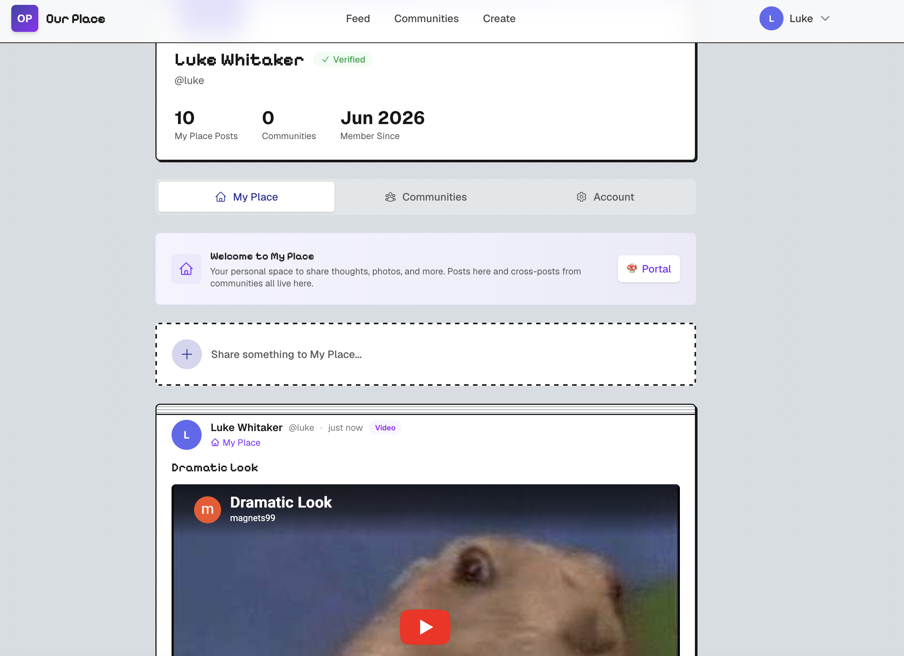
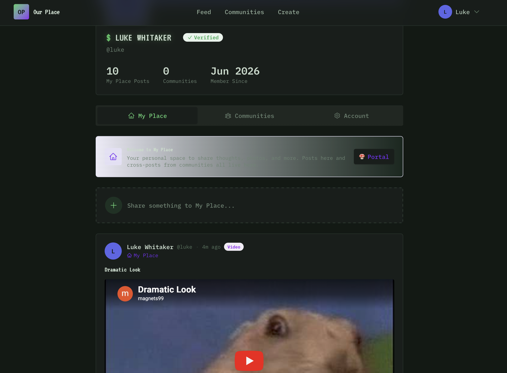
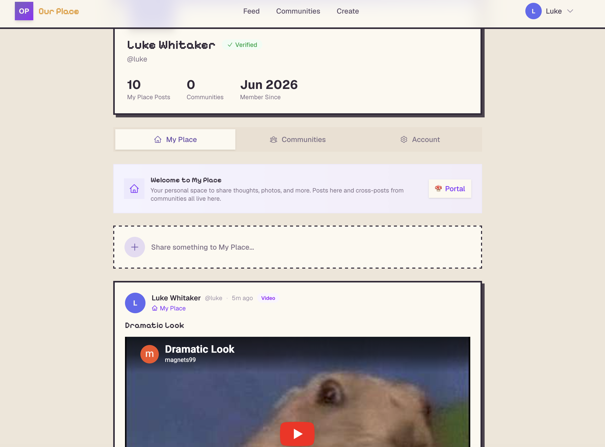
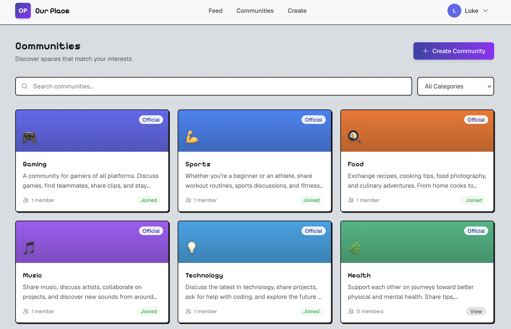
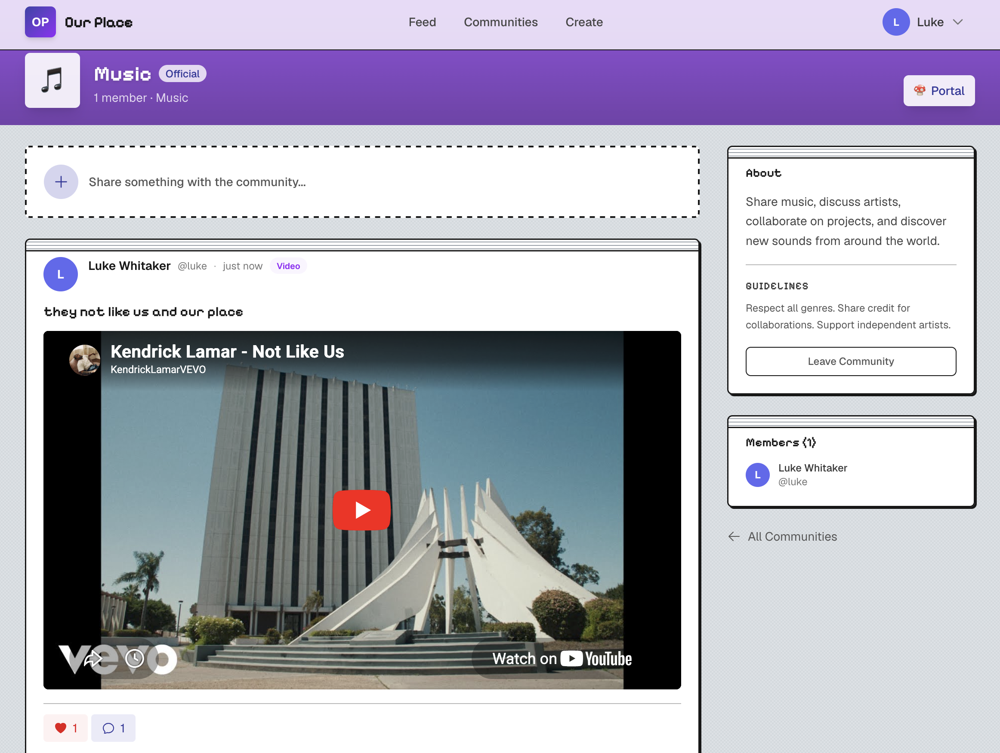

# Our Place

An invite-only community platform built on trust, belonging, and genuine human connection. Every account represents someone you've met face-to-face.


## What is Our Place?

Our Place is a community platform built on one conviction: **online spaces should be rooted in real-world relationships.** It brings the analog back into the digital — every account begins with a face-to-face connection, and everything the platform does is meant to push interaction back out into the real world.

There is no public registration. Accounts are created in person by existing members who have met you face-to-face. This "web of trust" means every person here is a real human, vouched for by someone in the community — and it's how Our Place grows beyond its first members.

Most social media silos people into echo chambers and infinite scroll. Our Place is the opposite: a digital layer for real communities, where you keep up with what's happening locally and turn online conversations into in-person ones.

### Two ways to experience it

- **The forum** — a Reddit-/Discord-inspired space to follow the communities you care about: post, comment, and react. Familiar social media, without the dark patterns.
- **The world** — an **8-bit RPG overworld** you can teleport into, where each community is a building in a town. Instead of scrolling mindlessly, you wander, explore, and build — leaving room for the kind of boredom that turns into a creative idea. Approach a building and step inside to reach its forum content. Think Roblox meets Reddit, but pixel art.

The forum is fully functional today. The world is actively in development.

## Philosophy

- **Social Media That's Actually Social** — The goal isn't time-on-app, it's getting people offline and together. Digital interaction here is a means to real-world connection, not a replacement for it.
- **In-Person First** — Accounts are created face-to-face by an admin or trusted member. No anonymous sign-ups, no bots, no strangers. Every user is someone a real person has met and vouched for.
- **Web of Trust** — The community grows organically through real relationships. You can trace every account back to a chain of people who know each other.
- **Your Algorithm, Your Rules** — Users will control their own feed algorithm. No engagement-maximizing dark patterns, no infinite dopamine loops. You decide what you see.
- **Physical Third Spaces** — The long-term vision includes physical community spaces (coffee shops, coworking hubs) where Our Place serves as the digital layer for a real neighborhood.

## Features

### Forum Platform

- **Communities** — Create or join communities organized by category (Gaming, Creative, Tech, etc.)
- **Rich Posts** — Text, photo, video, and rich editor post types
- **Comments & Reactions** — Threaded comments and emoji reactions on posts
- **Interaction controls** — The author chooses per post whether it can be liked, disliked, or commented on. Dislikes are off unless the author opts in.
- **Feed** — Three chronological views (your friends, your communities, everyone), each stating under its heading what it shows and how it is ordered. Nothing is ranked.
- **People** — A member directory that shows who invited whom, plus friend requests and your friends list
- **My Place** — Personal profile space for each user, friends-only
- **File Uploads** — Image and media uploads with validation

### Authentication & Security

- **Invite-only accounts** — admin-only account creation via dashboard (`/admin`); every account records the member who invited them
- JWT auth with httpOnly cookies and bcrypt password hashing
- Password reset flow
- Rate limiting on all auth and content creation routes
- Zod schema validation on all API request bodies
- Role-based access control (admin/user roles)
- **Account settings** — update your name, email, phone, and password (current password required)

### Three Themes

Three hand-built retro themes, switchable any time in **profile → Account → Appearance**:

- **Platinum** — System 7 / classic-Mac chrome: pinstriped window cards, 1-bit hard shadows, a dithered desktop, and a pixel wordmark.
- **Terminal** — dark phosphor: monospace body text, `$`-prompt headings with a blinking cursor, and faint CRT scanlines.
- **Pixel Dusk** — warm paper, chunky plum RPG-dialog borders, hard offset shadows, and buttons that press down when you click them.

The default, **Auto**, follows the clock — Platinum by day, Terminal at night — so the place looks different depending on when you visit. Your choice saves to your account and follows you across devices.

### 8-Bit World (In Progress)

An **isometric 2.5D** overworld you teleport into:

- **Isometric engine** — React + HTML Canvas, a 2:1 diamond projection with an autotiled ground, depth-sorted free-standing objects, and an 8-direction animated character
- Player movement (WASD/arrows + an on-screen joystick on touch devices), a camera that follows and clamps to the map, and per-tile collision
- **Ports** — walk into a building's door and you are inside it; sit at the computer to log on to that community's forum view. Portal buttons drop you back at its doorstep
- **Mushroom warp network** — discover shrines to unlock fast travel between them
- **The Capital** — an authored starter town with a building (and a Ports door) for each community
- **Interiors** — every community building has a furnished room behind its door, and every island house an empty one inside it, for its owner to make their own
- **PCs** — the terminal in each room: log on to that community's page, or travel PC to PC across the network
- **Floating My Place islands** — Every member has an island generated from their account: a cottage you can walk into, a garden path, a mailbox, a shrine back to the Capital, and the biome they chose. Islands start bare so each member can make theirs their own. Members pick who may visit: anyone, friends, or no one.
- **Pockets, the Notebook, and mailboxes** — carry things in 10 pocket slots, write notes in a Notebook from Gnomie, and leave them in a friend's mailbox. The flag goes up when a mailbox has mail.
- **The mycelium network** — Shrines link places: Home from any shrine in the Capital, the Capital from any island
- **Avatar builder** — gender-neutral character customization on first login

## Screenshots

### Three themes, one place

The same My Place profile rendered in each built-in theme. **Auto** mode switches between Platinum and Terminal with the time of day.

<table>
  <tr>
    <td align="center"><strong>Platinum</strong><br><sub>System 7 · day</sub></td>
    <td align="center"><strong>Terminal</strong><br><sub>phosphor · night</sub></td>
    <td align="center"><strong>Pixel Dusk</strong><br><sub>warm paper · opt-in</sub></td>
  </tr>
  <tr>
    <td></td>
    <td></td>
    <td></td>
  </tr>
</table>

### Around the platform

**Communities** — discover and join spaces organized by category.



**Inside a community** — posts, threaded comments, and emoji reactions.



## Tech Stack

| Layer      | Technology                     |
| ---------- | ------------------------------ |
| Framework  | Next.js 16 (App Router)        |
| Language   | TypeScript                     |
| ORM        | Prisma 7                       |
| Database   | PostgreSQL                     |
| Styling    | Tailwind CSS                   |
| Auth       | JWT + bcrypt                   |
| Validation | Zod                            |
| Testing    | Vitest (unit), Playwright (UI) |

## Project Structure

```
src/
├── app/
│   ├── api/            # REST API routes
│   │   ├── admin/      # Account creation (admin only)
│   │   ├── auth/       # Login, account settings, avatar, password reset
│   │   ├── communities/# CRUD, join/leave, posts
│   │   ├── posts/      # Comments, reactions, deletion
│   │   ├── feed/       # Friends, communities, everyone (all chronological)
│   │   ├── friends/    # Friend requests
│   │   ├── users/      # Member directory and public profiles
│   │   ├── my-place/   # Personal space posts
│   │   ├── upload/     # Media uploads to R2
│   │   └── version/    # The commit the running instance was built from
│   ├── admin/          # Admin dashboard
│   ├── auth/           # Login and password reset pages
│   ├── communities/    # Community browsing and detail pages
│   ├── feed/           # The feed
│   ├── people/         # Member directory and friends
│   ├── profile/        # My Place (yours and other members')
│   ├── avatar-builder/ # First-login character customization
│   ├── world/          # The isometric overworld: the Capital, your island, or a friend's
│   └── iso-lab/        # Engine sandbox (dev only)
├── components/         # React components (feed/ holds the feed's subcomponents)
├── test/               # Route-test harness (helpers, setup) for npm run test:routes
├── generated/prisma/   # Generated Prisma client (not committed)
└── lib/
    ├── game/           # The isometric engine (see .claude/rules/world-engine.md)
    │   └── worlds/     # The Capital, the island generator, and the lab town
    ├── types/          # Wire types by domain
    ├── api-client.ts   # apiFetch: the client-side API helper
    ├── auth.ts         # JWT, cookies, session revocation
    ├── db.ts           # Prisma client singleton
    ├── schemas.ts      # Zod schemas for every request body
    ├── storage.ts      # Cloudflare R2 uploads
    └── rate-limit.ts   # In-memory rate limiters
prisma/
├── schema.prisma       # Database schema (source of truth)
├── migrations/         # Prisma migration history
└── seed.ts             # Seed data (9 starter communities)
scripts/
├── backup-db.ts        # Nightly database dump to private R2 storage
├── create-admin.ts     # Bootstrap the first admin account
└── upload-world-art.ts # Push runtime art to R2
.github/workflows/      # CI, nightly backup, weekly restore check, deploy-drift alarm
```

## Getting Started

### Prerequisites

- Node.js 22+
- npm
- PostgreSQL (local or hosted)

### Installation

```bash
git clone https://github.com/luke-whitaker/our-place.git
cd our-place
npm install
```

### Database Setup

1. Create a PostgreSQL database (locally or on a service like Railway)
2. Copy `.env.example` to `.env.local` and set your `DATABASE_URL`
3. Run migrations and seed:

```bash
npx prisma migrate dev    # Apply schema migrations
npm run db:seed           # Seed starter communities
```

### Development

```bash
npm run dev
```

Open [http://localhost:3000](http://localhost:3000).

### Other Commands

| Command               | Purpose                        |
| --------------------- | ------------------------------ |
| `npm run build`       | Production build               |
| `npm run lint`        | ESLint                         |
| `npm run format`      | Prettier auto-fix              |
| `npm run test`        | Run unit tests                 |
| `npm run test:routes` | Run API route tests (Postgres) |
| `npm run test:watch`  | Run tests in watch mode        |
| `npm run db:migrate`  | Run Prisma migrations          |
| `npm run db:seed`     | Seed starter communities       |
| `npm run db:studio`   | Open Prisma Studio (DB viewer) |

## Roadmap

- [x] Core forum platform (communities, posts, comments, reactions)
- [x] Invite-only auth with admin dashboard
- [x] Rich post types and file uploads
- [x] Feed system with explore/friends tabs
- [x] My Place personal profiles
- [x] Security hardening (rate limits, Zod validation, transactions)
- [x] Game engine foundation (canvas, movement, camera, interactions)
- [x] PostgreSQL + Prisma migration (see v0.2.0 below)
- [x] Deploy to Railway (PostgreSQL + Dockerfile — see v0.3.0 below)
- [x] 32px tile upgrade + Aseprite generation pipeline
- [x] Avatar builder (gender-neutral first-login customization)
- [x] Procedural frontier world generator (500×500, 6 biomes, capital stamp, mushroom network)
- [x] Wire generated world into `WorldCanvas` (Phase B: loader + renderer)
- [x] Mushroom warp UI (warp menu, discovery tracking, teleport transition)
- [x] Ports v1 — two-way travel between forum view and world view (Portal buttons + doors)
- [x] Isometric world — 2.5D engine (iso projection, autotiled ground, depth-sorted objects, 8-direction character) with collision, doors, warp shrines, region toasts, and Ports
- [x] Authored capital town — a building with a Ports door for each community, composed as a serializable world document
- [x] Distinct building art — each community building is one of the six Evergrow Town_House sprites, half-scaled to fit the town's lots, with collision matched to each base
- [x] Water autotiling (4-edge blob autotiler + the animated pond in the Capital)
- [x] First-run onboarding — new members build a character, step straight into the world as it, and start in the Welcome Center
- [x] Operations backbone — CI on every push, nightly database backups with weekly restore verification, and a deploy-drift alarm
- [x] People page and honest feeds — a member directory with the web of trust visible, friend requests in one place, and chronological feeds that say what they show
- [x] Terrain tint experiment — autumn, snow, dusk, swamp, and scorched variants from the one forest sheet, in the engine sandbox
- [x] Viewport culling — the renderer draws only the diagonal bands and sprites the camera can see, with tests proving the output is unchanged
- [x] More space to explore — outskirts around the Capital
- [x] Floating My Place islands — one house, a biome you choose, a mushroom shrine back to the Capital, and a visitor setting
- [x] Post interaction controls — the author chooses whether a post can be liked, disliked, or commented on
- [x] API route tests — the reaction, comment, post, and island routes run against a real Postgres in CI
- [x] Gatherings in person: invitations by letter and notification, and calendars for communities and for you
- [x] Gatherings in the world, at an Event Mushroom the host plants
- [x] A map of the Capital, with the places you've been and the shrines you've found saved to your account
- [ ] Polls (designed, not built)
- [ ] Welcome tour — a once-per-version walkthrough for new members on their first visit and everyone else on their next (designed, not built)
- [x] A bigger world: snow, swamp, lake, autumn, and the sea, from Luke's hand-drawn map
- [ ] User-placed content sprites in the wilds
- [x] Ports v2 — building interiors with PC sprites
- [x] The world on a phone — a canvas sized to the screen, a touch joystick, and an interaction prompt you can't miss
- [x] Pockets, the Notebook, and mailboxes — items you carry, notes you write, and letters you leave for friends
- [x] A desk in every island house, to keep letters at home
- [x] Add to Home Screen, with our own mushroom as the app icon
- [ ] Seeds and flowers, to grow things on your island
- [ ] Player identity bound to world position (the name above the avatar is in)
- [x] Real-time multiplayer presence, with emotes

---

## Version History

### v0.21.0 — The Map (October 2026)

**Why:** The Capital grew three times bigger in September, and it's easy to lose your way in it.
A new phone also forgot every shrine you'd found, because discoveries lived in the browser.

**What changed:**

- **A minimap in the top-left of the Capital,** centred on you, in the same isometric
  direction as the screen, so up on the map is up on screen. Places you haven't been are
  greyed out, and the grey clears as you explore.
- **Tap or click it, or press M, for the whole map.** It marks where you are and names the
  shrines you've found. Close it with the ×, a tap outside, Esc, or M.
- **Your map follows your account.** The ground you've explored and the shrines you've found
  are saved to your account, so a new phone or laptop knows them. Shrines found on this device
  before today move over the first time you open the world, and the ground around each one
  counts as explored.
- **Just you on it.** The map never shows other members, and there's no count of who's
  exploring.

**What didn't change:** islands and building interiors have no map; they fit on one screen.
Your last position is still remembered per device. One migration adds `world_discoveries`.

### v0.20.0 — Gatherings in the World (October 2026)

**Why:** Some gatherings happen in the world itself: a walk to the Frost Shrine, tea on
someone's island, a social in a community's building. The Event Mushroom marks where, and gets
everyone there.

**What changed:**

- **Host a gathering "In the world"** from the same form. There's no address: it happens at
  your **Event Mushroom**, which arrives in your mailbox (or your pockets if the mailbox is full).
- **Plant it from your pockets** ("Plant here") in the shared world, on your own island, or
  inside the building of the gathering's community. It stands on open ground in front of you,
  clear of doors, shrines, and other mushrooms, and never where it would block a path. Until the
  start you can pick it up and move it; at the start it stays put, and at the end it's gone.
- **Plant it before the start, or the gathering is cancelled.** You and everyone going get a
  notification saying why.
- **Everyone sees a planted mushroom; only guests use it.** Your guests (the host, anyone
  invited, or members of the gathering's community) open a card with two tabs: **Gathering**
  (the time in Central time, the host, who's going, Accept and Decline, and Pick up for the
  host) and **Travel** (the same destinations as a shrine). Anyone else hears "A gathering is
  happening here."
- **The mushroom is on the Mycelium Network for its guests.** Every shrine and computer shows a
  **Gatherings** row while one is planted for you, landing beside its mushroom.
- **A Portal button** on every calendar the gathering appears on, and on its page, once the
  mushroom is planted.
- **Your island stays yours.** When a host plants on their own island, the gathering's guests
  can reach it through the portal while the mushroom stands, even if the island is closed to
  them. The house on it stays closed.

**What didn't change:** gatherings in person work exactly as before. One migration adds the
mushroom's world, tile, and planting time to `gatherings`.

### v0.19.1 — Harder Sign-In, Tighter Limits (October 2026)

**Why:** A September review left a list of smaller security gaps: sign-in was limited per
address but not per account, reset codes sat in the database as plain text with unlimited
guesses, and a few inputs had no upper bound. None was being used, and each was cheap to close.

**What changed:**

- **Each account allows 10 failed sign-ins an hour from a new browser,** counted across its
  username and email and from any address, on top of the per-address limit. A browser you've
  signed in from before skips both limits, so someone who knows your username can't lock you
  out, even from the same Wi-Fi. Changing your password forgets those browsers. A name with no account is limited the
  same way, so the two can't be told apart.
- **Reset codes are stored as a keyed hash and allow 5 wrong guesses.** The fifth wipes the
  code, and you request a new one. Codes outstanding when this shipped stopped working.
- **New passwords stop at 128 characters.** Signing in still accepts a longer one set before.
- **Post media must be uploaded here or come from YouTube or Vimeo,** with at most 10 items.
  Rich posts' image and video blocks follow the same rule.
- **Community descriptions stop at 1,000 characters and guidelines at 5,000.**
- **Behind the scenes:** sign-in tokens are checked with one pinned algorithm (HS256), responses
  no longer send `x-powered-by`, production runs Node 22, Next.js is on 16.3.8, workflows get a
  read-only token, and Dependabot proposes weekly updates.

**What didn't change:** members sign in, post, and reset passwords the same way as before.

### v0.19.0 — Gatherings, in Person (September 2026)

**Why:** Our Place exists to get people together in real life, and until now there was no way to
plan that here. Events come back as Gatherings, rebuilt around invitations people answer.

**What changed:**

- **Host a gathering** from "Host a gathering" on your calendar (the new **My Gatherings** tab
  of your profile) or a community's calendar: a name, a start and end, an address, and optional
  details. Any member can host.
- **Invite your friends with a tap,** search for anyone else by name, or **tie it to a community
  you belong to** to invite everyone in it, plus any additional invitees from outside it.
- **Your profile's tabs are now My Posts, My Communities, My Gatherings, and My Account.**
- **Invitations arrive twice:** as a letter from the host in your mailbox and as a notification.
  Accept or Decline from either one; your answer shows in both, and you can change it until the
  gathering starts. The letter never includes the address, since letters can be handed on.
- **Each gathering has its own page** with the address, visible only to people who can see the
  gathering at all. Guests see who's going. The host sees everyone's answers and can cancel,
  which tells everyone who was going.
- **Calendars:** every community page has a month calendar and an Upcoming list for its members.
  Your My Place has your own calendar, which only you see: gatherings you're hosting, invited to,
  or going to. Declined and cancelled ones drop off.
- **The admin Metrics page** counts gatherings each week, by the week they ended. Invitation
  letters no longer count as letters.

**What didn't change:** gatherings in the world and the Event Mushroom come next, in v0.20.0.
The old `events` tables are untouched. One migration adds the `gatherings` and
`gathering_invites` tables and a `gathering_id` column on items and notifications.

### v0.18.0 — Activity Counts, and a Letter from Luke (September 2026)

**Why:** With no analytics at all, there was no way to tell whether Our Place is being used, or
how. The counts answer that with totals only.

**What changed:**

- **An admin-only Metrics page** at `/admin/metrics`, linked from the admin dashboard. It shows
  weekly active members, time spent in the world, posts, comments, reactions, letters, and new
  friends for the last 12 weeks, plus retention by the month members joined. Nothing on it names
  a member.
- **What is counted:** the days a member signs in, and how long the world stays open while
  they're in it (each visit capped at 3 hours). Days and weeks follow Chicago time. Nothing about
  what anyone reads or where they walk is kept.
- **"Leave me out of activity counts"** in Account settings. Turning it on stops the counting and
  deletes the days already counted. Posts, comments, and letters still show in the totals, since
  they're already part of the site.
- **A letter from Luke** in every member's mailbox explains the counts and the switch. New members
  get it too, after the welcome letter.

**What didn't change:** existing APIs, apart from the account settings route accepting the new
switch. One migration adds the `activity_days` table and the `exclude_from_metrics` column; a
second delivers Luke's letter to existing members.

### v0.17.0 — Notifications (September 2026)

**Why:** Friend requests sat unanswered because nobody knew they were there, and people had no
way to know someone had reacted to or commented on their post.

**What changed:**

- **A Notifications page,** from the menu under your name. It lists friend requests, friends
  accepting yours, and reactions and comments on your posts, newest first, from the last 90 days.
- **Answer friend requests right there** with Accept or Decline.
- **Reactions are grouped per post** ("Ada and Ben reacted to your post"), rather than one line
  per like. Dislikes never notify. Nobody is ever notified about their own activity.
- **A dot, never a number.** A small dot on your avatar and beside Notifications means something
  new; opening the page clears it. Nothing is emailed or pushed to your phone.
- **Notifications tidy themselves up:** a canceled request, a removed reaction, or a deleted
  comment takes its notification with it.

**What didn't change:** existing APIs. One migration adds the `notifications` table; a second gives
every friend request still waiting for an answer its notification, so older requests show up too.

### v0.16.0 — Visit Friends from Any Shrine or Computer (September 2026)

**Why:** A friend's island was only reachable from their profile page. Inside the world, where
the mycelium network already takes you everywhere else, there was no way to get to a friend.

**What changed:**

- **A "Friends" row at every mushroom shrine and computer** opens a list of the friends whose
  islands you're allowed to visit, by name. Pick one and the network takes you to their island's
  shrine. It never drops you inside their house.
- **The list follows each friend's visitor setting,** the same rule as walking onto their island,
  so a closed island never appears. The island you're standing on is left out.
- **Long menus fit any screen.** On a laptop, a list taller than the window scrolls with the
  selection, with ▲ and ▼ marking more rows. On a phone held sideways, menu tiles sit four
  across, so the largest computer menu still fits without scrolling.

**What didn't change:** the database. One new read-only API, `GET /api/friends/islands`.

### v0.15.3 — Room to Write, Doors That Wait, and My Place (September 2026)

**Why:** Feedback from members. The comment box stayed one line however much you wrote, so a
long comment was hard to read over before posting. Doors opened when you walked into them, which
took people inside buildings they were only walking past. And "Home" in the world didn't match
what the rest of Our Place calls your place.

**What changed:**

- **The comment box grows as you write,** up to about ten lines, then scrolls. Line breaks you
  type now show in the posted comment.
- **Doors open only when you choose:** press Enter, or A on a phone. Walking into a door no
  longer takes you inside.
- **"Home" is now "My Place"** at every mushroom shrine and computer, and in the titles of your
  own island and house.

**What didn't change:** APIs and the database.

### v0.15.2 — Members Only, and Your Password for Sign-In Changes (September 2026)

**Why:** Our Place is invite-only, but anyone on the internet could still read the communities,
their posts and comments, and who belongs to each, and could walk the world without an account.
Separately, changing your email only needed a signed-in session, so someone at an unlocked
device could change it and then take the account through "Forgot password."

**What changed:**

- **Every piece of content needs an account.** The community list, each community's page and
  members, its posts, and comments now answer 401 to anyone logged out, and the world sends a
  logged-out visitor to the login page before anything of it loads.
- **Changing your email or phone asks for your current password,** as changing your password
  already did. A wrong password is refused before anything else is checked.
- **Your old address hears about an email change,** so if it wasn't you, you find out.

**What didn't change:** members see everything they saw before. Name, theme, biome, mailbox
color, and island visibility still change without a password.

### v0.15.1 — Uploads Stay in Their Folder (September 2026)

**Why:** The upload route named each stored file with the extension from the uploader's
filename. A crafted filename with percent-encoded `..` segments could send a signed-in member's
upload outside `images/`, for example over a piece of world art in the same bucket. It was
found in a review before anyone used it, and each storage key was already limited to its own
bucket.

**What changed:**

- **The extension comes from the file type the server already checked** (`image/jpeg` is always
  `.jpg`), never from the filename.
- **Storage refuses any unsafe key.** `uploadToStorage` accepts only plain path segments ending
  in an extension, so every caller, including `npm run world:upload`, is covered.
- Route tests upload hostile filenames and confirm each one lands in `images/`.

**What didn't change:** accepted file types, size limits, and API responses.

### v0.15.0 — A Bigger World, and an Armoire at Home (September 2026)

**Why:** Now that members can see each other, the world needed room to go exploring together,
and a way to choose how you show up in it, including not at all.

**What changed:**

- **The world is three times bigger in every direction,** grown from Luke's hand-drawn map
  around the Capital, which is unchanged in the middle: snow across the north (The Frostline),
  a walled swamp to the west (Mirewood), a walled lake to the east (Stillwater Lake), autumn
  woods in the south-west (Emberwood), and open woodland everywhere between. Trails guide you
  out from town, but you're free to wander off them.
- **The sea** runs along the whole south, with sandy beaches and an island just out of reach.
  It's uncharted for now.
- **Three new mushroom shrines** join the network once you find them: in the snow, in the
  swamp, and on the coast past the lake.
- **An armoire in every island house.** Save up to five outfits (hair style and color, shirt,
  pants, and shoes, with a color wheel for any exact color), wear one, and everyone nearby sees
  the change right away. Your skin tone stays as you chose it.
- **Ghost Mode,** in the armoire: you see yourself see-through, and nobody else sees you at all
  until you wear an outfit again.

**What didn't change:** existing APIs. Two migrations add the `outfits` table and
`users.ghost`, then hair to outfits. Your saved spot in the Capital moves with the town.

### v0.14.0 — See Each Other in the World (September 2026)

**Why:** The world was a place you walked through alone. Now members in the same place see
each other, so running into a friend at the pond is something that can actually happen.

**What changed:**

- **Live presence.** Everyone in the same world or room shows up in their own avatar colors
  and hair, with their name tag, walking smoothly rather than jumping. You walk through each
  other, and nobody blocks a door.
- **Your island stays yours.** Islands and houses follow your existing visitor setting: someone
  who can't visit your island never sees who's on it. Logged-out visitors see no one.
- **Six emotes:** heart, laugh, mushroom, wow, question, and sparkle, in a bubble over your head
  for three seconds. Press 1 to 6 on a keyboard, or tap the emote button under full screen in
  the world's top-right corner.
- **No counts.** Nothing anywhere says how many members are in the world. You find out by going.

**What didn't change:** existing APIs. Presence adds three routes (`/api/presence`,
`/api/presence/emote`, and `/api/presence/stream`, a Server-Sent Events stream per world) and
keeps who's where in memory on the one server, with no new services.

### v0.13.0 — A Desk at Home, and Our Place on Your Home Screen (September 2026)

**Why:** Letters had nowhere to live once you took them out of the mailbox, so every house now
has a desk to keep them in. And the world is at its best filling the whole screen, which on a
phone only a home-screen app can do, so Our Place is now installable, with its own mushroom.

**What changed:**

- **A desk in every island house,** against the back wall under the window. It holds 100 things
  across 10 pages of 10: letters, notes, the Notebook, anything that fits in your pockets. Read,
  take, or throw away from the desk, just like the mailbox.
- **The desk is yours alone.** A visitor who tries it finds it locked.
- **Add Our Place to your home screen** on a phone, tablet, or laptop. It opens without the
  browser around it.
- **Our own mushroom,** drawn for Our Place, is the app icon, the browser tab icon, and every
  door into the world: the button beside the logo, Portal, and Visit island.
- **A letter from Our Place** waits in every mailbox with the steps for your device.

**What didn't change:** existing APIs. Items gain a third location, the desk; the only
migration adds the welcome letter.

### v0.12.0 — Mailboxes, and Islands That Start Bare (September 2026)

**Why:** The Notebook let you write, but nobody could receive what you wrote. A letter left at
a friend's home is the most real-world thing the world can do, so every island now has a
mailbox. And islands were decorated by a random generator rather than by the people who live
there, so they start bare now, ready for members to fill.

**What changed:**

- **A mailbox on every island,** beside the garden path. Anyone allowed to visit your island
  can walk up, press Enter (or A), and leave you a note from their pockets. The note moves to
  you; it isn't copied.
- **The flag goes up** whenever your mailbox holds mail, and anyone walking by can see it.
  There are no notifications: you find out by going home.
- **Reading your mail:** at your own mailbox, read a letter where it is, take it into your
  pockets, or throw it away. Every letter says who left it and when, whatever the writer
  signed. A mailbox holds 20 letters, twice your pockets, so emptying a full one takes at most
  two trips.
- **Visitors only leave mail.** Nobody but you can see what's inside your mailbox.
- **Pick your mailbox's color,** slate, green, or blue, in Account settings beside your
  biome. Visitors see the color you chose.
- **Bare islands and houses:** islands no longer grow random trees, bushes, and rocks, and
  houses no longer come furnished. Each island keeps its own coastline, cottage, shrine, and
  mailbox, and each house keeps its computer. A desk comes next, then seeds and flowers to grow
  your own.

**What didn't change:** existing APIs. Items gain a location (pockets or mailbox) and a sender;
the migration only adds columns.

### v0.11.0 — Pockets, Gnomes, and the Notebook (September 2026)

**Why:** The world had places to go but nothing to carry, and nobody in it but members. This is
the first step of the item system that mailboxes, seeds, founding markers, and the wilderness
all build on, and it starts with something to do: write to a friend.

**What changed:**

- **Two gnomes:** Gnomie tends a planter inside the Welcome Center and gives every member a
  Notebook, once. Gnomette hangs out by the mirror pond, musing about ripples and frogs, and
  hints at a gift that isn't ready yet. Walk up, press Enter (or A), and they turn to face you
  and talk.
- **Pockets:** the 👖 button in the world's top corner (or P on a laptop) opens 10 pocket
  slots. Tap an item to see what you can do with it.
- **The Notebook:** write up to 10 private drafts of up to 1,000 characters, edit them,
  crumple them up, or tear one out. A torn-out page becomes a Note in your pockets that you
  can read or throw away. When mailboxes arrive, a Note is what you'll leave in a friend's.
  The Notebook itself can never be thrown away.
- **Visitors** who aren't logged in can still meet the gnomes, who ask them to come back as
  members; Pockets are for members only.

**What didn't change:** existing APIs. New tables hold items, drafts, and one-time gifts.

### v0.10.5 — Skin Shading and Fresh Art (September 2026)

**Why:** The neck, ears, and hands mid-stride were painted with a color the avatar recolor
filed under hair, so they took the hair color: orange-brown on dark or green skin. And after
v0.10.4 shipped, browsers kept showing the old blushing character for days, because world art
is replaced in place and the art host sends no cache instructions.

**What changed:**

- **Necks, ears, and hands follow the skin tone:** that color is now the skin's deepest
  shadow, as dark as the original art drew it, in any skin color.
- **Art refreshes on every deploy:** world art addresses carry the deployed version, so every
  browser fetches the current art once after each deploy instead of keeping an old copy.

**What didn't change:** no API, schema, or art changes.

### v0.10.4 — Short Hair, and No Blush (September 2026)

**Why:** The avatar builder had no hair choice, because only the long-hair sheet was ready.
The short-hair sheet is now finished. The builder had also been quietly saving "short" as
everyone's hair style, a default nobody picked, while the world only ever drew long hair.
And both characters had pink blush on their cheeks, which Luke wanted gone.

**What changed:**

- **Short or long hair:** the avatar builder has a Hair style choice, and the world draws
  whichever you pick, in your colors.
- **Everyone keeps the look they have:** a one-time update sets existing avatars to long
  hair, the look members chose their colors against. New members also start with long hair
  and can switch in the builder.
- **No blush:** the pink cheek patches are painted out of both characters. The face keeps
  its shading.
- **No more pink flecks:** in browsers with anti-fingerprinting protection (Luke's Firefox,
  and likely Brave and Safari), reading the character's pixels returned about one in eight a
  shade off on purpose. Those pixels missed the recolor and kept the original pink shirt and
  blue pants, so every avatar had pink and purple flecks. The recolor now matches each pixel
  to the nearest paint within a tiny margin, and a browser that scrambles pixel reads entirely
  gets the character in its original colors instead of static.

**What didn't change:** no API changes and no schema change. The only data change is the
one-time hair style update.

### v0.10.3 — Full Screen for the World (September 2026)

**Why:** On a phone, the world shared the screen with the browser's address bar and buttons,
our navbar, the page title, and the padding around the world. Held sideways, that left the
world a strip across the middle of the screen. On a laptop it stayed a 960x640 window in the
middle of the page.

**What changed:**

- **A full screen button:** a see-through button in the world's top-right corner lets the
  world take over the screen, on phones, tablets, and laptops. Tap or click it again to
  minimize. It stays on as you travel through doors and PCs, and ends when you go to a forum
  page.
- **The most each device allows:** on Android, iPad, and laptops the browser's own bars
  disappear too, and Esc also leaves full screen. Every browser on an iPhone (Chrome included)
  runs on Safari's engine, which doesn't let web pages go full screen, so there the world
  hides our navbar and padding and fills all the space the browser gives it, about a third
  taller held sideways.
- **Bigger on a laptop, not wider:** in full screen a laptop shows the same view of the world
  as before, scaled up to fill the screen.

**What didn't change:** no API, schema, or art changes.

### v0.10.2 — Tap to Travel on Phones (September 2026)

**Why:** On a phone, the PC and Mycelium Network menus were small rows drawn inside the world,
driven by the joystick one row per push and chosen with A. Reaching "Home" from "Log on" took
nine separate pushes, the rows were about half the height a thumb needs, and on a phone held
sideways the PC menu didn't fit: its title and Cancel row were cut off.

**What changed:**

- **Tap where you want to go:** on phones and tablets, a PC or shrine opens a grid of large
  buttons over the world. "Log on" runs across the top and destinations fill the columns below.
  Tap one and you travel. ✕, or a tap outside the menu, closes it.
- **It fits:** the largest menu shows every button on a phone held sideways, down to a
  320-pixel-tall screen, with no scrolling.
- **The joystick and A button step aside** while a menu is open, so they never cover it.

**What didn't change:** laptops and desktops keep the keyboard menu as it was. No API,
schema, or art changes.

### v0.10.1 — PCs Open Their Menu (September 2026)

**Why:** On a laptop, pressing Enter at a PC could skip its menu or send you out of the
building. Three causes, found one after another:

- Clicking the 🍄 in the navbar to enter the world left keyboard focus on that link, and moving
  between places inside the world never moved it. Enter at a PC then did two things: the prompt
  flashed green, and the browser followed the focused link back to the Capital, where you
  landed at your last saved spot (the door you had walked in through, or the shrine you took
  Home from).
- A held Enter repeated fast enough to pick the menu's first row the moment it opened.
- In five rooms the tile beside the PC was also within reach of the exit, and the exit won.

**What changed:**

- **The world takes the keyboard on arrival:** entering any place clears focus from the
  navbar, and Enter or Space pressed on a focused link or button is left to that link or
  button. The world is also reachable with Tab, so a keyboard user can move focus back to it.
- **Enter ignores key repeat**, so holding it opens the menu without choosing from it.
- **The nearest thing wins:** when a door and a PC are both in reach, the prompt, Enter, and
  walking all act on whichever is closer.

**What didn't change:** no API, schema, or art. Phones were never affected, because the A
button does not go through keyboard focus.

### v0.10.0 — The World on a Phone (September 2026)

**Why:** The world was drawn as a fixed 960x640 desktop view and then shrunk to fit the screen.
On a phone that made the whole world about 374x249 pixels, a strip across the top of the
screen, and the "Press Enter" text at the bottom landed near 4 pixels tall. Even on a desktop
the prompt was small and grey, and easy to miss. The four-button touch pad couldn't walk the
town's streets, which run diagonally on screen, without zigzagging.

**What changed:**

- **The world fits the screen:** on a phone or tablet the world fills the space under the
  navbar in either orientation, and a phone shows fewer tiles at a readable size instead of
  the desktop view in miniature. The zoom is always a whole number of screen pixels per art
  pixel, so the pixel art stays crisp on every screen. Desktop keeps the same 960x640 view.
- **A prompt you can't miss:** walking up to a door, a computer, or a shrine shows a bright
  yellow label just above your character, with the key to press ("Enter", or "A" on touch).
  Press it and the label flashes green for a moment before the door opens or the menu
  appears, so you can see your press land.
- **Readable text:** every piece of world text is sized in real screen pixels, and the
  toasts, menus, and name tags are a little larger than before.
- **A joystick on touch screens:** the four-button pad is now a thumb stick that moves in
  eight directions, so a street is one smooth push. The A button is unchanged.
- **No lost taps:** a quick tap on A, or a press made while the page stutters, is no longer
  missed between game ticks.

**What didn't change:** no API, schema, or migration, and no new art. Doors still open by
walking into them or pressing Enter, and every Ports deep link lands where it did.

### v0.9.0 — Ports v2: Interiors and PCs (September 2026)

**Why:** A door that teleported you to a web page made the world a menu. Buildings had no
inside, so the Capital was a facade you walked past. Ports has always meant that the forum and
the world are two views of one place, with PCs as the travel points between them — that needed
rooms to put the PCs in, and the art for them did not exist until now.

**What changed:**

- **Nine building interiors** — every community building opens into a room sized to the
  building outside it, and each one has its own floor plan. A room is a union of rectangles
  rather than a single box, so a hall can have a set-back annex, a recessed stage, or a wing,
  and a run of wall pieces can partition it into a front room and a back workshop.
- **Doors open two ways** — walk up into one and you are inside, or press Enter. The test is
  on the screen direction of your movement, not the tile row, because the tile axes run
  diagonally: walking east along a street is screen down-right, and reading the row axis alone
  would make both town streets impassable, since every building door sits on one.
- **Rooms are bare on purpose** — a room reads as its own place through its size and shape,
  where the light falls, and the stone patch on its floor. Scattered furniture crowded them
  and, in four rooms, boxed the computer into a corner. Empty and unfinished is the better
  starting point, and furniture has to earn its way back in.
- **Island houses** — the cottage on a member's island opens too. The room is generated from
  their account like the island itself, so a new member has a home the moment they exist, and
  no two houses are furnished alike. Who may come in follows the island: if you can stand on
  the doorstep, you can come inside.
- **PCs** — the computer in every room is the third thing you can interact with, beside doors
  and shrines. Press Enter at one to log on (a community's page from its building, your
  profile from your house) or to travel to another building's PC. A house PC reaches all nine
  buildings; a building PC reaches the other eight and home.
- **Engine** — a world can name its own ground sheet, so an interior paints `grass` as
  floorboards and `dirt` as stone flags with no new terrain kind and no autotiler change. Doors
  gained an optional `warpTo`/`spawnAt`, so a door can open a world instead of porting to a
  page, and the round trip closes itself with no new spawn machinery.
- **A live art bug fixed** — the blush color was listed in the shirt palette ramp but painted
  only on cheeks, so picking a blue shirt gave you blue cheeks. Cheeks are pink again.

**What didn't change:** no API, schema, or migration. Every existing door keeps working —
`warpTo` is optional — and the Ports deep link (`/world?at=<slug>`) still lands you at a
building's door.

### v0.8.0 — Islands, the Outskirts, and Interaction Controls (September 2026)

**Why:** The world had one town and nowhere to be alone in it, and a member's "place" in the
forum had no counterpart in the world beyond a cottage door in the Capital. The forum, meanwhile,
gave authors no say in how people could respond to a post, and the API had no tests at all.

**What changed:**

- **Floating My Place islands** — every member has an island generated from their account
  (nothing about its layout is stored): a cottage whose door ports to their profile, a garden
  path, an island shrine, and trees in a biome they pick in Account settings. The Capital's
  shrines gain a Home entry that lands you at your island shrine; the island shrine takes you
  back to the Capital gate. Members choose who may visit (anyone, friends, or no one, friends
  by default), and a friend's profile shows a "Visit island" Portal when their island is open.
  The Capital's old My Place cottage is gone: from town, the only way home is the network.
- **The outskirts** — the Capital now sits inside a map almost twice its size: a forest ring
  that thins toward town, three dirt trails out (the Old Road south, a west trail to Miller's
  Clearing, an east trail to Mirror Pond), two shrines out in the woods, and the North Woods
  with the pack's tall trees. The lot where the My Place cottage stood is a fenced park with a
  well, lamps, and a bench; the plaza has lamps and crates. Every region is proven reachable.
- **Post interaction controls** — the author chooses at compose time whether a post can be
  liked, disliked, or commented on. Dislikes are opt-in, counted apart from likes, and one
  reaction per member: a dislike replaces a like. Cards show "Comments off" when the author
  said so.
- **API route tests** — the first tests at the API boundary: reactions, comments, post
  creation, and the island visit gate run against a real Postgres, locally and in CI.
- **Engine** — `void` ground for floating places, a tint target on every catalog entry and a
  biome tint per world, links between worlds in the warp menu, per-world save slots, an
  arrival fade-in, and the member's name drawn above their avatar.

**What didn't change:** community, comment, and friendship API shapes. Posts carry four new
fields (`dislike_count`, `allow_reactions`, `allow_comments`, `allow_dislikes`); the reaction
response now returns exact counts. `/api/users/[username]/island` is new.

### v0.7.0 — People, Honest Feeds, and the World Decision (September 2026)

**Why:** The first real members surfaced three kinds of friction in the same week. Finding
someone who had never posted was impossible, because the only path to a profile ran through
a post. The feed's second tab was still labeled "Endless Scroll" from the earliest prototype,
which contradicts the thesis on the front page. And events were half-built: a calendar with
no way to create an event or RSVP. Meanwhile the world's direction had been undecided since
August over one question, whether new biomes need new art.

**What changed:**

- **People page** (`/people`) — friend requests, your friends, and a searchable directory of
  every member, each row showing who invited them. The web of trust is now visible, and
  adding a friend no longer requires finding one of their posts. People also gets a navbar
  link and the feed's bottom-bar slot.
- **Honest feeds** — the "Endless Scroll" tab is now "Everyone", every feed is chronological
  (the everyone feed had been ranked by reactions), and each tab states under its heading
  exactly what it shows and how it is ordered.
- **Events removed** from the UI and API. The tables stay; events come back later, built
  around getting people into a room.
- **Editable display name** in Account settings.
- **Correctness** — community creation is one transaction; HSTS is sent and the deprecated
  `X-XSS-Protection` header is gone; a member's role is read from the database on every
  request, so promotions apply immediately; every client page calls the API through one
  helper that surfaces errors and sends an expired session to the login page instead of
  rendering an empty feed.
- **World direction decided: the world stays isometric.** The terrain tint experiment
  (`/iso-lab?world=capital&tint=autumn`) showed that one HSL pass at load turns the forest
  sheet into autumn, snow, dusk, swamp, and scorched variants that read as different places,
  with pines staying evergreen and buildings keeping their paint. Biome variety no longer
  depends on buying art.
- **Viewport culling** — the isometric renderer now iterates only the diagonal bands of
  tiles and the sprites that can intersect the camera, about a quarter of the Capital per
  frame and under 3,000 tiles of a 500x500 world. A brute-force property test proves the
  culled set always covers every tile that touches the view, and a before-and-after pixel
  comparison of the live world showed no change. This is the prerequisite for a bigger world.
- **Project instructions** restructured: a shorter `CLAUDE.md` plus path-scoped rules under
  `.claude/rules/`.

**What didn't change:** post, comment, community, and friendship API shapes. `/api/events`
is removed and `/api/users` is new.

### v0.6.1 — Photo Uploads Actually Work (September 2026)

**Why:** Adding a photo to a post failed with "Failed to upload file." for every real photo.
R2 requires `Content-Length` on every PUT and has no chunked-upload support, but undici streams
any request body at or above its 64 KiB high-water mark, and a streamed body loses the header
`fetch` would otherwise derive. R2 answered `411 MissingContentLength`. Uploads under roughly
64 KB still succeeded, so the two small test images already in the bucket made the feature look
healthy from the June migration onward. The first real photo from the first real user found it.

**What changed:**

- **Uploads send an explicit `Content-Length`** — `src/lib/storage.ts` sets it from the body
  length. `scripts/backup-db.ts` carried the same defect and was passing only because the
  nightly dump is still far under 64 KB, so it got the same fix before a growing database
  turned it into a failing backup.
- **Storage failures name their cause** — a missing R2 variable raises `StorageConfigError`
  (HTTP 503, logging exactly which variables are absent), and an object R2 refuses raises
  `StorageUploadError` (HTTP 502, carrying the R2 status). Both replace a single opaque 500.

**What didn't change:** API response shapes, accepted file types, and size limits are identical.

### v0.6.0 — The World Goes Isometric (June 2026)

**Why:** The world had been a top-down tile map — functional, but flat. To make it the explorable, characterful place the project is about, it moved to an **isometric 2.5D** view built around a purchased character and the Evergrow Forest art. The migration was also the moment to lay architecture seams for where the world is headed: a shared, multiplayer, player-built space.

**What changed:**

- **Isometric engine** — a 2:1 projection with a diamond-autotiled ground, depth-sorted free-standing objects (trees, rocks, buildings, the warp shrine), and an 8-direction animated character. Movement, collision, doors, warp shrines, region toasts, the warp menu, and fade transitions all carried over from the top-down engine, now in iso. `/world` runs on it; the top-down engine, tileset, sprite generators, and the 500×500 procedural generator were retired.
- **Serializable world model** — a place is a plain `IsoWorld` document (terrain grid + a list of placed objects + doors + shrines + regions) in world-space tile coordinates, validated with Zod and loaded behind a source-agnostic interface (a file today, a database row later). Collision is a pure function over that data — the same code a server could run.
- **The Capital** — an authored starter town: streets and a central plaza, a building for each community (whose door ports you into that community's forum view), framing trees, and the mushroom warp network. Buildings use a placeholder cottage for now; swapping in distinct art is a per-building one-liner.
- **Built for what's next** — the engine models the world as a static map plus an entity collection (the local player is one entity), splits input (`computeIntent`) from movement (`applyMovement`), and keeps positions in world space. Those are the seams that let parallel and real-time multiplayer — and Builder/Creator user-generated spaces — slot in later without a rewrite.

**What didn't change:** the forum, Ports' contract (`/world?at=<slug>` ↔ a door porting back to `/communities/<slug>`), and the avatar builder's procedural preview. The account model and APIs are untouched.

**Not yet done (intentional):** distinct per-building art (the Evergrow Town_House sprites), water autotiling, Ports v2 interiors, and binding player position to identity in the database.

### v0.5.0 — Three Themes: Platinum, Terminal, Pixel Dusk (June 2026)

**Why:** The forum had been deliberately unstyled while the platform went live. This cycle
gave Our Place its look — and instead of picking one retro direction, all three became
user-selectable themes. The default, **Auto**, follows the clock: the place looks different
at night, like a real place does.

**What changed:**

- **Semantic design tokens** — every component now references a single palette
  (`surface` / `ink` / `line` / `accent`) defined in `globals.css` via Tailwind v4 `@theme`;
  retheming is a values-edit in one file.
- **Three themes** —
  **Platinum** (System 7 chrome: pinstriped window cards, 1-bit hard shadows, dithered
  desktop, pixel wordmark), **Terminal** (dark phosphor: monospace body, `$`-prompt headings
  with a blinking cursor, faint CRT scanlines, flat panels), and **Pixel Dusk** (warm paper,
  chunky plum RPG-dialog borders, hard offset shadows, buttons that press down, amber
  wordmark).
- **Auto mode** — Platinum 7am–7pm, Terminal at night; any theme can be pinned in
  profile → Account → **Appearance** (live preview swatches). The choice is saved to the
  account (`users.theme`) and follows you across devices, with a localStorage echo and a
  CSP-nonce'd pre-paint script so the right theme renders with no flash.
- **Theme typography** — Pixelify Sans display headings (Platinum/Dusk), VT323 + IBM Plex
  Mono (Terminal), loaded via `next/font`.

**What didn't change:** layout, components, and API shapes. Themes are token values plus a
thin chrome layer — no component was redesigned.

### v0.4.1 — Media Moves to Cloudflare R2 (June 2026)

**Why:** Uploads were written to a persistent volume on the host, which tied media to a single
deploy environment, required the container to start as root to fix mount ownership, and left
bandwidth egress as the looming cost driver. Object storage with zero egress fees is the right
long-term home for media.

**What changed:**

- **Uploads go to Cloudflare R2** — the upload API now does a signed PUT to R2
  (`src/lib/storage.ts`, via the dependency-free `aws4fetch`) and returns the absolute public
  URL. Object keys mirror the old `/uploads/<type>/<uuid>.<ext>` layout.
- **CSP follows the media** — the R2 public host is added to `img-src`/`media-src` in
  `src/proxy.ts`, derived from `R2_PUBLIC_BASE_URL` at runtime.
- **Volume teardown** — with no runtime writes to `public/`, the Dockerfile now runs as the
  `nextjs` user from the start (`USER` directive); the root-start + `su-exec` privilege drop
  and the `start.sh` ownership fixups are gone, along with the volume itself.

**What didn't change:** API response shapes, accepted file types, and size limits are identical.

### v0.4.0 — The World Goes Live: Ports v1 (June 2026)

**Why:** The generated frontier had been sitting on disk since April. This cycle made it the
actual, explorable heart of the platform — and introduced **Ports**: the idea that the forum
and the world are two views of the same place, and you travel between them deliberately.

**What changed:**

- **World loader** — `WorldCanvas` now fetches the generated 500×500 frontier
  (`world.bin` + `world.meta.json`) and renders it through the existing frustum-culled
  engine. The hand-built test map is retired from the live page.
- **Ports (v1)** — "Portal" buttons on My Place and community pages drop you into the world
  at that building's door (`/world?at=<slug>`); walking into a door ports you back to that
  place's forum view. Two views, one place.
- **Mushroom fast travel** — walking up to a shrine discovers it ("Sun Beach Shrine
  discovered!"); pressing Enter opens the Mycelium Network warp menu listing your discovered
  shrines. The Capital Gate starts unlocked. Warps ride the existing fade transition.
- **Region toasts** — entering the capital or any of the 6 frontier nodes shows a brief
  banner with the region's name.
- **Per-device persistence** — position and discovered shrines are saved to localStorage
  (a stopgap until player position is bound to identity in the DB).
- **Account settings** — profile → Account now edits email, phone, and password
  (current password required, rate-limited).
- **Production fixes** — media rendering after the Prisma migration (video embeds, photo
  galleries), upload permissions on the Railway volume, date parsing fossils.

**Next (Ports v2):** building interiors with PC sprites — enter a building, sit at the PC,
and choose to "log on" (exit to the forum view) or warp to another PC.

### v0.3.0 — Railway Deployment + Avatar Builder + Frontier World (April 2026)

**Why:** With the platform on Postgres and the forum stable, this cycle focused on three things: getting Our Place actually running in production, making the first-login experience feel personal, and laying the groundwork for the 8-bit world to be more than a bare test map.

**What changed:**

- **Deployed to Railway** — production Dockerfile (multi-stage build with standalone Next.js output), PostgreSQL service linked, healthcheck on `/`. Several iterations to get the Docker runner stage correct: full `node_modules` copy (native binaries + Prisma/effect runtime deps), Prisma schema copied into deps stage, dummy env vars for build-time Next.js compilation, `.npmrc` removed so native binary installs work.
- **Avatar builder** — gender-neutral character customization shown on first login. Hair style, skin tone, shirt color, pants color, stored as JSON on the user record. No male/female selector.
- **Audit overhaul** — invite-only auth tightened, admin dashboard cleanup, `createUserSchema` consolidation (removed orphaned `registerSchema`), code-quality pass across the admin surface.
- **32px tile upgrade** — tile size doubled from 16px to 32px for better readability at modern resolutions. New Aseprite Lua scripts (`scripts/generate-tiles.lua`, `scripts/generate-player.lua`) for sprite-sheet generation.
- **Procedural frontier world generator** (`scripts/generate-world.ts`, `npm run world:generate`) — deterministic 500×500 tile world built from a single seed. 9-stage pipeline: base fill → 8 passages (tree-walled corridors with tall-grass patches) → lakes + rivers (Iowa River N-S) → 6 themed nodes (flower meadow, beach, mountain valley, island, misty grove, ancient ruins) → capital stamp at (220,230) → wilderness fill (noise-driven forest vs. clearing) → border wall → mushroom warp network (1 capital gate + 6 node shrines, full-mesh connections). Emits `public/world/world.bin` (one byte per tile) and `world.meta.json` (spawn, doors, node bounds, passages, mushroom network).
- **8 new tile types** — `TALL_GRASS`, `FLOWER_RED/YELLOW/PURPLE`, `SAND`, `MOUNTAIN`, `MUSHROOM`, `STONE_RUIN` — palette entries and placeholder procedural sprites (to be refined in Aseprite later).
- **Seed trimmed** — 12 starter communities → 9, with simpler names.

**Not yet done (intentional):** The generated world is on disk but not yet read by `WorldCanvas`. Phase B — loader + renderer + mushroom warp UI — is the next cycle.

### v0.2.0 — PostgreSQL + Prisma Migration (April 2026)

**Why:** SQLite (better-sqlite3) was the right choice for prototyping — zero setup, file-based, fast to iterate. But Our Place is a multi-user platform headed for production deployment. SQLite can't handle concurrent writes from multiple users reliably, and it doesn't work on most cloud hosting platforms (Railway, Render, etc.) without workarounds. PostgreSQL is the industry standard for this kind of app.

**What changed:**

- **Database engine**: SQLite (better-sqlite3) → PostgreSQL, using `@prisma/adapter-pg` driver
- **ORM**: Raw SQL queries → Prisma 7 with full type-safe client
- **Schema**: Defined in `prisma/schema.prisma` (single source of truth) instead of inline `CREATE TABLE` statements in `db.ts`
- **Migrations**: Runtime column-checking hacks (`PRAGMA table_info`) → Prisma's migration system (`prisma migrate dev`)
- **Seeding**: Moved from `initializeDatabase()` to a dedicated `prisma/seed.ts` script
- **All 18 API routes** converted from synchronous `db.prepare().run/get/all()` to async Prisma client calls
- **SQLite-specific syntax** replaced: `datetime('now')` → `@default(now())`, `MAX(0, x)` → `GREATEST(0, x)`, `COLLATE NOCASE` → Prisma's `mode: "insensitive"`, `INSERT OR IGNORE` → `upsert`
- **Config updates**: Removed `better-sqlite3` from dependencies, updated `next.config.ts`, added Prisma scripts to `package.json`

**What didn't change:** All API response shapes are identical. The frontend is unaffected — no client-side code was modified.

### v0.1.0 — Initial Build (Feb 2026)

Forum platform with full auth, communities, posts, comments, reactions, events, file uploads, feed, and "My Place" profiles. 8-bit game engine prototype with tile rendering, player movement, camera system, and building interactions. Built with Next.js 16, TypeScript, SQLite, and Tailwind CSS.

---

## Related

- [Portfolio Site](https://github.com/luke-whitaker/portfolio-site) — My pixel-art RPG portfolio, the prototype that inspired the game engine in this project

## Author

**Luke Whitaker** — Linguist, researcher, and developer working at the intersection of language, technology, and digital interfaces.
